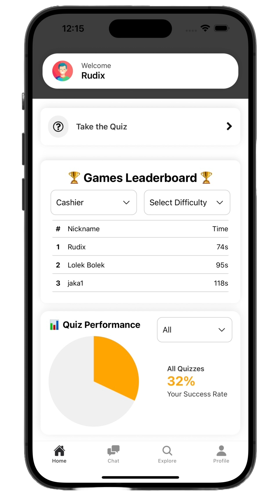
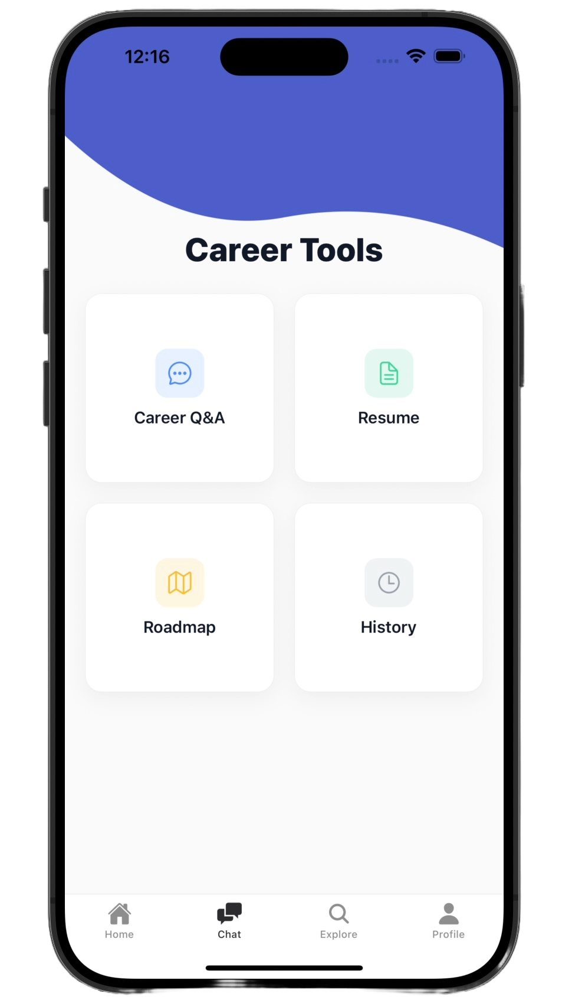
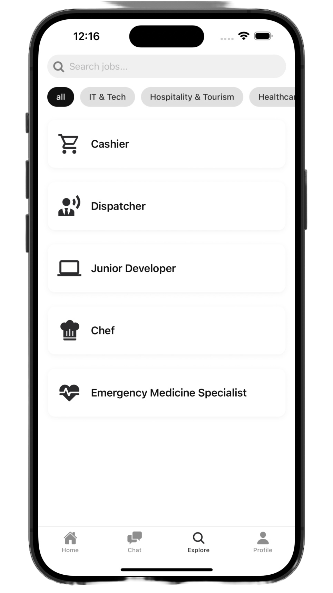
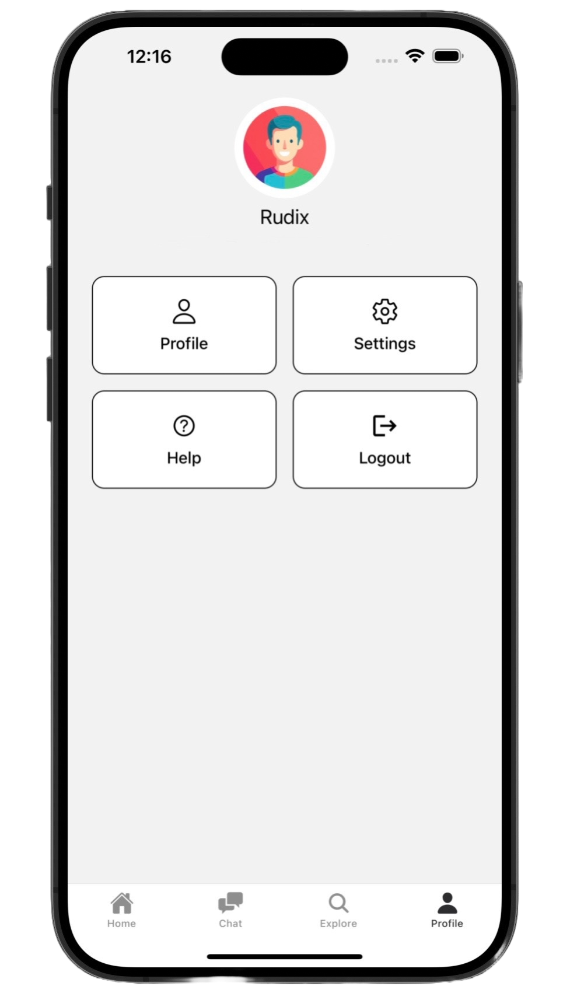
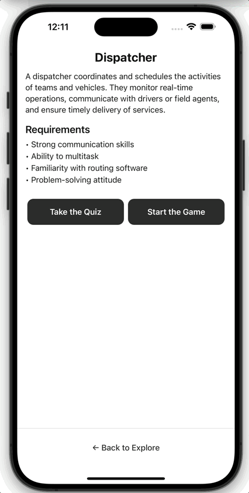

# JobSim – Interaktivna simulacija karier

JobSim je izobraževalna mobilna aplikacija, ki uporabnikom omogoča raziskovanje različnih poklicev, kariernih poti in osebnih preferenc skozi kvize in simulacije. Cilj je pomagati posameznikom razumeti, kateri poklici jim najbolje ustrezajo na podlagi njihove osebnosti in interesov.

---

## 🚀 Funkcionalnosti

- ✅ Google prijava (Clerk)
- 🧠 Predikcija poklica z modelom CatBoost (ML)
- 🧩 Poklicne simulacije (Cashier, Chef, itd.)
- 📊 Kvizi z vizualnim prikazom uspešnosti
- 🏆 Leaderboard s filtri in analitiko
- 📀 MongoDB za shranjevanje rezultatov
- 🔁 Posodabljanje obstoječih vnosov
- 📤 Email obvestila o napredku
- 🌐 Dockerized backend na Render.com
- 📱 Expo + React Native frontend

---

## ⚙️ Tehnološki sklad

### 🎯 Frontend

- React Native + Expo + Expo Router
- Clerk (OAuth login)
- DonutChart, Leaderboard, kvizi, simulacije
- Ikone z `react-native-vector-icons`

### 🧠 Backend

- FastAPI (Python)
- MongoDB + Motor
- Pydantic 2.x
- CatBoost (strojno učenje)
- Uvicorn

### ☁️ Deployment

- Docker + Dockerfile
- Render Web Service (Docker)

---

## 🧾 Arhitektura

```
📁 JobSim/
├── frontend/               # Expo aplikacija (React Native)
└── backend/
    ├── app/
    │   ├── main.py         # FastAPI vstopna točka
    │   ├── routes/         # API endpoints
    │   └── models/         # ML modeli (.pkl)
    ├── Dockerfile
    └── requirements.txt
```

---

## 🐳 Docker Deploy (Render)

**Dockerfile**:

```dockerfile
CMD ["uvicorn", "app.main:app", "--host", "0.0.0.0", "--port", "8000"]
```

**Render Settings**:

- Language: Docker
- Root Directory: `backend`
- Build & Start Command: pustimo prazno
- Environment variables:
  - `MONGO_URL=...`
  - `SENDGRID_API_KEY=...`

---

## 📱 Lokalni zagon

### Frontend

```bash
git clone https://github.com/tvoj-username/jobsim.git
cd jobsim/frontend
npm install

# Uredi .env datoteko
touch .env
```

`.env`:

```env
CLERK_PUBLISHABLE_KEY=...
CLERK_FRONTEND_API=...
EXPO_PUBLIC_API_URL=https://your-backend.onrender.com
```

```bash
npx expo start --tunnel
```

### Backend

```bash
cd backend
python3 -m venv venv
source venv/bin/activate
pip install -r requirements.txt

# .env datoteka
touch .env
```

`.env`:

```env
MONGO_URL=...
SENDGRID_API_KEY=...
```

```bash
uvicorn app.main:app --reload --port 8000
```

---

##  Testiranje

- Ročno preko Postman
- Testirani endpointi: `/predict`, `/submit`, `/leaderboard`, `/check_existing`
- UI testiranje preko Expo Go (simulacije + kvizi)

---

## 📸 Posnetki zaslona

<p align="center">
  
  
  
  
  
</p>

---

## Preizkusite aplikacijo

<p align="center">
  
</p>

---

## Nadaljnji razvoj

- Implementacija dodatnih poklicov
- Nadgradnja in optimizacija AI modelov
- Vpeljava sistema obračunavanja (billing process)

---

##  Avtorji
 * Aleš Močnik
 * Jaka Cvikl
 * Jernej Jerot
